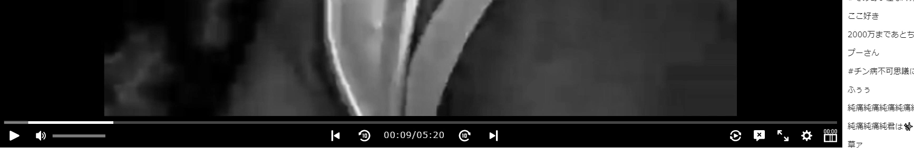

# Toggle NicoNico SeekBar&Time

ニコニコ動画のシークバーと時間の表示/非表示を切り替えます。

## 使用方法

### インストール

1. scriptフォルダをダウンロード
1. chromeの拡張機能ページ`(chrome://extensions/)`を開く
1. `「パッケージ化されていない拡張機能を読み込む」`からダウンロードした`script`フォルダを選択

### 画面での操作

インストールすると動画下部のコントローラエリアに新しいボタンが追加されます。  
該当のボタンをクリックして表示/非表示を切り替えてください。

 

### 拡張機能パネルでの操作

chrome 上部の拡張機能パネルのアイコンから操作することも可能です。

